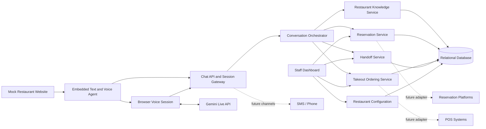

# High-Level Design v1: Restaurant Customer-Service Agent

**Status:** Saved baseline for detailed design workshops. Changes to this baseline should be recorded explicitly rather than silently replacing it.

> **Learning-track cost addendum (September 24, 2026):** The product decisions
> in this V1 remain the baseline, but its hosted-model and AWS recommendations
> are not required implementation choices for the 1v1 course. The binding
> course path is the
> [Zero-Cost Tooling Policy](../free-tooling-policy.md):
> deterministic fake plus local Ollama inference, local data services, and
> local Kubernetes staging. Hosted free tiers are optional synthetic-data
> comparisons, and AWS is a design-only mapping.

## Goal

Build a complete fictional restaurant website as the first test environment, embed the web-chat customer-service agent in it, and provide a private staff dashboard. After the system works end to end with realistic synthetic data, onboard one pilot restaurant and retain a path to a configurable multi-restaurant platform. The first release will:

- Answer trusted questions about hours, location, policies, and menu.
- Create reservations using real availability and restaurant rules.
- Create takeout orders for payment at pickup.
- Transfer customers to staff live chat when someone is available, or create a follow-up ticket otherwise.
- Offer an optional in-browser voice conversation using the customer's microphone and speakers, with the same visible transcript and controls as text chat.

The MVP will use a built-in operations dashboard, reservation engine, and internal APIs. The mock restaurant will exercise real application logic with synthetic data; only external providers and communications will be simulated. POS, reservation-platform, SMS, voice, and online-payment integrations are later phases.

## Core design principles

1. **The model converses; services decide.** The language model interprets requests and explains results, but deterministic backend services own prices, availability, policies, and writes.
2. **Every consequential action is confirmed.** The agent summarizes reservation or order details and receives explicit customer confirmation before creating it.
3. **One mock restaurant, then one pilot, with multi-tenant foundations.** Every business record is scoped by `restaurant_id` and `location_id`, while the first test deployment enables one fictional location.
4. **Configuration over custom prompts.** Hours, menus, policies, tone, escalation rules, and locations live in validated structured configuration.
5. **Human fallback is a product feature.** Customers can request staff help, and uncertainty or policy exceptions trigger an explicit handoff rather than a fabricated answer.
6. **Integration boundaries start clean.** Reservations and orders use provider interfaces so internal services can later be replaced by adapters for systems such as Toast, Square, OpenTable, or Resy.
7. **The model provider is replaceable.** Conversation workflows and tool contracts must not depend on one vendor's SDK or model-specific response format.
8. **The website and agent share one source of truth.** Public pages, staff tools, and agent tools read the same validated restaurant records; the model never scrapes the mock website for operational facts.

## High-level architecture

### 1. Customer channel

- Embeddable text-and-voice chat widget with session continuity.
- Structured UI elements for time slots, menu items, modifiers, review, and confirmation.
- User-initiated microphone access, live captions, listening/speaking indicators, mute/stop controls, and barge-in.
- Accessible text fallback whenever voice is unsupported, denied, unavailable, or undesirable.
- Channel-independent message contract so SMS and telephone channels can be added later.

### 2. Conversation orchestration

- Detects intent, collects missing fields, calls approved tools, and composes responses.
- Maintains short-lived conversation state separately from durable reservations and orders.
- Uses a small workflow/state machine for transactional flows instead of relying on free-form model memory.
- Permits only schema-validated tool calls and never gives the model direct database access.
- Routes low-confidence, unsupported, sensitive, or customer-requested cases to staff.

#### Development language model

The following hosted-provider decision is preserved as the original V1
research. For the 1v1 learning track, it is superseded by the zero-cost local
model path linked above.

Use the **Google Gemini API with `gemini-3.7-flash`** as the default free hosted model for local development.

Why it is the best starting fit:

- Google's current documentation positions the Flash model for agentic workflows and documents native JSON-schema function calling, including sequential and parallel calls.
- The Gemini API free tier currently includes free input and output tokens for eligible models, with project-specific limits visible in Google AI Studio.
- It is capable enough to evaluate intent recognition, slot collection, tool selection, and natural customer-facing replies without local model hardware.

Important boundary: this recommendation is for local development with synthetic customers and non-confidential restaurant data only. Google's current unpaid-service terms say submitted content and responses may be used to improve its products and may be reviewed by humans; they explicitly say not to submit personal, sensitive, or confidential information. The terms also restrict API clients likely to be accessed by people under 18, which makes the unpaid service inappropriate for a public restaurant deployment. Before any real-customer pilot, move to a paid service with acceptable data terms or choose another contracted provider.

Implement a small provider-neutral model gateway:

- Application-facing operations such as `respond(messages, tools)` and normalized tool-call results.
- Tool definitions expressed once as JSON Schema and validated again by the application.
- Provider and model selected through server-side configuration; the API key never reaches the browser.
- Timeouts, bounded retries for transient failures, rate-limit handling, and explicit unavailable responses.
- A deterministic fake provider for automated tests and recorded synthetic conversations.

GroqCloud is the secondary development option if very low latency or an OpenAI-compatible API is more important. Its official documentation supports local tool calling across hosted models and strict structured outputs on selected models, but exact free limits are account- and model-specific. The provider-neutral gateway allows a comparison without redesigning the agent.

Official references checked for this decision:

- [Gemini API pricing](https://ai.google.dev/gemini-api/docs/pricing)
- [Gemini function calling](https://ai.google.dev/gemini-api/docs/function-calling)
- [Gemini API terms](https://ai.google.dev/gemini-api/terms)
- [Groq tool use](https://console.groq.com/docs/tool-use)
- [Groq structured outputs](https://console.groq.com/docs/structured-outputs)
- [Groq rate limits](https://console.groq.com/docs/rate-limits)

#### Website voice strategy

The following hosted voice recommendation is also preserved as V1 research.
The required 1v1 track has no paid or hosted voice dependency; its optional
zero-cost path uses local speech recognition and browser speech synthesis.

Use **Gemini Live API with `gemini-3.1-flash-live-preview`** as the primary free hosted voice service for the mock restaurant. Google's current documentation describes low-latency audio-to-audio conversation, barge-in, input/output transcripts, and function calling. Its current pricing page lists free input and output on the free tier.

This is the best fit for a realistic voice-agent test, but it is a preview model: availability, behavior, and rate limits can change. The same unpaid-service data restriction applies, so use only synthetic names, phone numbers, and restaurant data.

The browser voice flow will be:

1. The customer explicitly starts voice mode and grants microphone permission; the application never listens automatically.
2. The authenticated backend mints a one-use, short-lived Gemini ephemeral token constrained to the selected Live model and audio configuration. The long-lived API key never reaches the browser.
3. The browser opens a direct WebSocket to Gemini Live for the lowest latency and streams microphone audio.
4. Gemini returns spoken audio plus input/output transcripts. The UI shows finalized captions and keeps them in the same conversation history as text messages.
5. Function calls are forwarded to the backend, which authenticates the session, validates the JSON schema, enforces workflow state and authorization, executes the deterministic domain service, and returns only the tool result. The browser and model never receive database access.
6. Ending voice mode returns to ordinary text chat without losing context.

Consequential actions use a two-step backend protocol: prepare and validate the reservation/order, display and read back the exact date, time, party size/items, price, policy, and contact details, then accept a confirmation call only for that unchanged pending action after a separate explicit customer confirmation turn. Replays and duplicate confirmations are rejected.

| Free option | Best use | Main limitation |
|---|---|---|
| **Gemini Live API** | Recommended natural, real-time audio conversation with tool calls | Preview service; project limits can change; unpaid data may be used for product improvement |
| **Browser Web Speech API** | Zero-key fallback using `SpeechRecognition` and `SpeechSynthesis` | Recognition support and quality vary; some browsers send audio to a vendor service; on-device recognition is still experimental |
| **Groq Whisper + Orpheus** | Fast push-to-talk transcription and generated speech behind server APIs | Separate STT/TTS requests rather than one full-duplex session; free limits are model/account-specific |
| **ElevenLabs free API** | Voice-quality comparison | Current free quota is limited and intended for evaluation, not production volume |

The Web Speech API fallback should use feature detection, not browser-name checks. Speech synthesis has broad browser support, while speech recognition is less consistent. Always retain manual text input.

Implement a provider-neutral voice boundary for session events, final/partial transcripts, audio output, interruptions, tool calls, and failures. Include a deterministic fake voice provider for automated tests. Gemini Live is the first adapter; browser speech, Groq, or another provider can be substituted without changing reservation or ordering services.

Official references checked for this decision:

- [Gemini Live API](https://ai.google.dev/gemini-api/docs/live-api)
- [Gemini Live function calling](https://ai.google.dev/gemini-api/docs/live-api/tools)
- [Gemini ephemeral tokens](https://ai.google.dev/gemini-api/docs/live-api/ephemeral-tokens)
- [Gemini API pricing](https://ai.google.dev/gemini-api/docs/pricing)
- [Web Speech API](https://developer.mozilla.org/en-US/docs/Web/API/Web_Speech_API)
- [Groq speech to text](https://console.groq.com/docs/speech-to-text)
- [Groq text to speech](https://console.groq.com/docs/text-to-speech)
- [ElevenLabs API pricing](https://elevenlabs.io/pricing/api)

### 3. Restaurant configuration and knowledge

Structured data should cover:

- Restaurant identity, locations, time zones, contact details, and directions.
- Regular hours plus holiday and one-off closures.
- Menus, prices, modifiers, availability, preparation constraints, taxes, and fees.
- Reservation capacity, party-size limits, service windows, lead time, and cancellation policy.
- Pickup capacity, lead times, cutoff rules, and sold-out items.
- Approved FAQs, allergen disclaimers, tone, languages, and escalation contacts.

Operating hours, menu prices, availability, and policies must come from structured records. Search over approved documents can support long-form FAQs, but should not override structured facts.

### 4. Reservation service

- Searches available slots using location, date, time, party size, duration, and capacity rules.
- Offers valid alternatives when the requested time is unavailable.
- Collects only required contact details and special requests.
- Creates a reservation atomically after explicit confirmation.
- Returns a reference number and records an auditable status history.

The initial service will own availability in the built-in system. A provider interface will allow a future external reservation platform to become the system of record.

#### Reservation API strategy

There is no universal, self-service public API that can create reservations across arbitrary restaurants.

- **Google Maps Platform is not a booking backend.** Places API can supply a Google Place ID, address, coordinates, phone, website, opening hours, and a `reservable` boolean. That boolean only indicates that a place supports reservations; Places API does not expose live slots or create, update, or cancel bookings.
- **Reserve with Google is a future distribution channel, not an open booking API.** Its Actions Center integration requires an approved partnership, direct contracts with represented restaurants, real-time inventory, and an onboarding process that Google's current guide says typically takes 12–16 weeks.
- **Major reservation networks generally gate transactional APIs.** OpenTable, Resy, and SevenRooms require restaurant/customer or approved-partner access. Do not depend on unofficial or reverse-engineered endpoints.
- **Eat App is the strongest documented adapter candidate.** Its official Partner API supports availability and reservation creation, while its Concierge API documents availability, create/read/update/cancel, idempotency, and webhooks. Access still requires an Eat App partnership, restaurant subscription/authorization, and a provided API key; it is not anonymous public access.

For the MVP:

1. Keep the built-in reservation service as the source of truth so the pilot can accept real reservations without waiting for a third-party partnership.
2. Ask whether the pilot restaurant already uses a reservation platform. If it uses Eat App and can provision sandbox credentials, implement the Eat App adapter instead of duplicating its inventory.
3. Optionally use Google Places during restaurant setup to prefill public profile data, but require staff review and keep operational hours/policies in our database.
4. Never run two writable reservation systems without an explicit source-of-truth and synchronization design.

The provider interface should support capability discovery plus `searchAvailability`, `createReservation`, `getReservation`, `modifyReservation`, `cancelReservation`, and event synchronization. The built-in implementation and every external adapter must share normalized request/result types, idempotency behavior, and error categories.

Official references checked for this decision:

- [Google Places `Place` resource](https://developers.google.com/maps/documentation/places/web-service/reference/rest/v1/places)
- [Google Reservations End-to-End eligibility](https://developers.google.com/actions-center/verticals/reservations/e2e/overview)
- [Google Actions Center dining integration](https://developers.google.com/actions-center/verticals/dining/guides/end-to-end-integration/overview)
- [Eat App Partner API](https://restaurant.eatapp.co/knowledge/using-the-eat-app-partner-api-to-get-and-post-availability)
- [Eat App Concierge API](https://restaurant.eatapp.co/knowledge/using-the-eat-app-partner-api-to-get-and-post-availability-0)
- [OpenTable Partner Portal](https://dev.opentable.com/)
- [SevenRooms API access](https://api-docs.sevenrooms.com/)

### 5. Takeout ordering service

- Presents the active menu and validates item availability and required modifiers.
- Calculates the authoritative subtotal, tax, fees, and estimated pickup time on the server.
- Revalidates the full cart immediately before confirmation.
- Creates an idempotent order after explicit confirmation.
- Sends the order to the staff dashboard and records acceptance, preparation, readiness, completion, or rejection.
- Uses pay-at-pickup only in the MVP, so the system stores no payment-card data.

The initial service will own menu and orders. A provider interface will later connect the same conversation workflow to a POS.

### 6. Staff operations

- Unified queue for incoming orders, reservations, live-chat requests, and tickets.
- Presence state so the agent knows whether live transfer is available.
- Staff controls to accept, reject, update, or resolve requests with a customer-visible reason.
- Configuration screens for hours, menu, policies, capacity, and temporary exceptions.
- Role-based access, audit history, and operational alerts.

### 7. Data and platform services

- Relational database as the source of truth for restaurant configuration, customers, conversations, reservations, orders, and handoffs.
- Durable event/audit records for state changes and external side effects.
- Idempotency keys for create operations and transactional checks to prevent duplicate orders or overbooking.
- Notification abstraction for in-chat updates first, with email/SMS adapters later.
- Observability for tool failures, response quality, handoff rate, completion rate, latency, and staff actions.

## Mock restaurant test environment

Create one realistic, fictional, single-location restaurant as a versioned seed fixture. The website should feel like a real customer-facing property while remaining safe to reset and test locally.

### Customer website

- Responsive home page with restaurant identity, story, featured menu items, location, contact details, and calls to action.
- Menu page with categories, prices, descriptions, modifiers, dietary tags, allergen notes, availability, and sold-out states.
- Hours and location page with weekly hours, holiday exceptions, directions, parking/transit notes, and contact information.
- Reservation and takeout pages that use the same backend APIs available to the agent.
- FAQ and policy content covering reservations, lateness, cancellation, large parties, children, accessibility, pets, takeout, and allergens.
- Persistent embedded chat launcher with page context, session continuity, structured option cards, confirmation summaries, and visible handoff state.
- Optional voice mode with an explicit start action, microphone permission state, live captions, spoken responses, interrupt/stop controls, and seamless return to text.

The conventional website controls and the agent must be interchangeable paths to the same operations. A reservation created through a form must immediately affect availability shown by the agent, and vice versa.

### Private staff dashboard

- Local authentication with manager and staff roles.
- Reservation calendar/list with create, confirm, seat, complete, cancel, and no-show actions.
- Capacity and table configuration, service periods, turn-time rules, blackout windows, and large-party thresholds.
- Takeout queue and status controls.
- Staff online/offline presence, live-chat inbox, ticket queue, assignment, and transcript view.
- Editors for menu availability, hours, holiday exceptions, FAQs, policies, and temporary announcements.
- Audit view showing customer actions, agent tool calls, backend decisions, and staff overrides.

### Seed data and test controls

- A believable restaurant profile, complete menu, modifiers, taxes/fees, policies, FAQs, weekly schedule, holiday overrides, tables/capacity, staff accounts, and sample reservations/orders.
- Edge-case fixtures for full service periods, invalid party sizes, same-name guests, sold-out items, holiday closure, late pickup, duplicate submission, and daylight-saving transitions.
- Prerecorded synthetic audio fixtures covering dates, times, party sizes, phone numbers, accents, background noise, restaurant/menu names, corrections, interruptions, and ambiguous confirmations.
- Development-only controls to reset the database, advance/freeze the clock, fill selected time slots, toggle staff presence, change item availability, and simulate dependency failures.
- Voice failure controls for microphone denial, unsupported browser APIs, dropped WebSockets, provider timeout, rate limiting, transcription error, and interrupted playback.
- A visible environment banner and fictional contact/customer data so the mock site cannot be mistaken for a real restaurant.
- In-app notification previews instead of sending real email or SMS.

Use a deterministic seed and reset command so every manual demo and automated end-to-end run starts from a known state.

## Key domain boundaries

| Domain | Main records | Owns |
|---|---|---|
| Restaurant | restaurant, location, hours, policy, FAQ | Canonical business facts and configuration |
| Menu | menu, category, item, modifier, availability | Current offerings and authoritative pricing inputs |
| Reservation | availability rule, slot/capacity, reservation, status event | Slot validation and booking lifecycle |
| Ordering | cart, order, line item, pickup promise, status event | Totals, validation, and takeout lifecycle |
| Conversation | session, message, tool invocation, consent/confirmation | Dialogue context and traceability |
| Handoff | staff presence, live conversation, ticket, assignment | Human escalation lifecycle |

These should be modules in a modular monolith for the mock restaurant and pilot, not independently deployed microservices. Clear interfaces preserve an upgrade path without adding early operational complexity.

## Primary customer flows

### Information request

1. Identify the requested restaurant location.
2. Retrieve structured facts or approved FAQ content.
3. Answer with the relevant date, time zone, policy, or menu context.
4. Escalate rather than infer if no trusted answer exists.

### Reservation

1. Gather location, date, preferred time, party size, and optional constraints.
2. Query live availability and present valid slots.
3. Gather name, contact method, and special requests.
4. Show a final summary and relevant policy.
5. Receive explicit confirmation and create the reservation once.
6. Return a reference number and make the result visible to staff.

### Takeout order

1. Establish location and desired pickup timing.
2. Build a cart from the active menu and required modifiers.
3. Validate availability and calculate the server-authoritative total.
4. Gather customer name, contact method, and optional notes.
5. Show the complete order, price, pickup estimate, and pay-at-pickup terms.
6. Receive explicit confirmation and create the order once.
7. Show staff acceptance and later status updates in chat.

### Human handoff

1. Trigger on customer request, low confidence, unavailable data, policy exception, complaint, or operational failure.
2. Transfer the conversation and context to an available staff member.
3. If no one is available, create a prioritized ticket and set a clear response expectation.
4. Preserve the conversation summary, but do not claim the issue is resolved.

### Website voice conversation

1. Start voice mode only after a customer gesture and microphone consent.
2. Stream audio while showing listening state and live captions; allow interruption, mute, stop, or immediate switch to typing.
3. Reuse the same information, reservation, order, and handoff tools as text chat.
4. For names, phone numbers, dates, times, party sizes, and order totals, read back and display the normalized value.
5. Require a separate explicit confirmation turn for a prepared consequential action.
6. Persist the text transcript and tool audit trail; do not retain raw audio by default.

## Safety, privacy, and reliability

- Minimize customer PII, encrypt it in transit and at rest, restrict staff access, and define retention/deletion rules before launch.
- Treat customer messages and imported restaurant content as untrusted input; isolate them from system instructions and tool permissions.
- Validate every tool argument and authorization server-side.
- Never invent hours, prices, menu availability, allergen safety, reservation availability, or order status.
- Present allergen information as restaurant-provided data, include an appropriate disclaimer, and escalate uncertainty to staff.
- Use restaurant-local time zones and explicit dates; handle daylight-saving changes and holiday exceptions.
- Rate-limit abuse and protect public endpoints, staff accounts, and administrative changes.
- Keep an audit trail of model-requested tools, validated inputs, resulting writes, and staff overrides.
- Provide graceful, honest recovery when the model, database, or an integration is unavailable.
- Never send real customer PII or confidential restaurant information to an unpaid model API; use synthetic fixtures until production-grade data terms are in place.
- Ask for microphone permission in context, visibly indicate capture, provide an immediate stop control, and disclose the external voice processor used.
- Do not store raw microphone audio by default. Store finalized transcripts only under the same retention and access rules as chat, and make transcript corrections visible.
- Treat transcripts as untrusted input; recognition confidence or fluent audio must never bypass tool validation or explicit confirmation.

## Delivery stages and todos

### Stage 1: Define the mock restaurant

- Define the fictional brand, location, menu, hours, policies, reservation rules, ordering rules, staffing model, and escalation behavior.
- Create deterministic seed data and edge-case scenarios that exercise all customer and staff workflows.
- Define MVP success metrics and an acceptance-test conversation set.
- Resolve remaining product choices such as guest identity/contact verification, reservation changes/cancellations, and customer notifications.

### Stage 2: Specify the platform

- Define domain models, state transitions, tenant/location boundaries, and retention rules.
- Specify contracts for chat tools, the normalized reservation provider, internal ordering providers, future external adapters, and staff events.
- Define reservation-provider capabilities, idempotency, error mapping, webhook handling, and source-of-truth rules.
- Specify a provider-neutral LLM gateway and normalize Gemini tool calls behind it.
- Specify the voice-session boundary, transcript lifecycle, ephemeral-token endpoint, audio-retention policy, and confirmation protocol.
- Create low-fidelity customer and staff workflow designs.
- Choose the remaining implementation stack only after the contracts and operational needs are clear.

### Stage 3: Build the foundation

- Implement the modular backend, database, authentication/authorization, restaurant configuration, audit events, and observability.
- Build the realistic customer website, embed the web-chat shell, and build the private staff dashboard shell.
- Add database seed/reset tooling, a controllable test clock, and development-only scenario controls.
- Connect `gemini-3.7-flash` through the model gateway for synthetic local testing, with a deterministic fake provider for automated tests.
- Add the voice-session adapter, secure ephemeral-token issuance, and a deterministic fake voice provider.
- Add a test harness that evaluates both conversational quality and deterministic business outcomes.

### Stage 4: Deliver vertical slices

- Release trusted FAQ/hours/menu answers first.
- Add reservation search, confirmation, creation, and staff visibility through the built-in provider; use an Eat App sandbox adapter instead if the pilot can provision authorized access.
- Add takeout cart, pricing, confirmation, order creation, and staff status handling.
- Add live-chat transfer, offline tickets, and context handoff.
- After all text workflows are stable, connect `gemini-3.1-flash-live-preview` and exercise those same workflows through website voice mode.

Each slice should work end to end in a test environment before starting the next transactional flow.

### Stage 5: Validate the mock restaurant

- Run scripted, adversarial, accessibility, failure-recovery, concurrency, and staff usability tests.
- Test conventional website forms and agent conversations against the same availability and reservation state.
- Test voice with prerecorded fixtures and manual microphone sessions across supported browsers, including interruptions, corrections, ambiguous confirmations, provider limits, and fallback to text.
- Re-run the full suite from a deterministic reset and fix recurring failure patterns.

### Stage 6: Onboard and harden a real pilot

- Replace fictional configuration with pilot-approved restaurant data and validate every imported fact.
- Identify the restaurant's current reservation system, contract, API eligibility, sandbox access, and desired system of record.
- Move off unpaid model processing before using real customer PII.
- Shadow staff workflows before allowing autonomous writes, then enable controlled production traffic.
- Review transcripts and metrics with the restaurant and document operational ownership.

### Stage 7: Generalize

- Add restaurant onboarding and configuration validation.
- Prove tenant isolation and per-location policy behavior with a second restaurant.
- Add POS/reservation adapters, SMS, telephone/telephony voice, hosted online payment, multilingual support, and richer analytics based on measured demand.

## MVP acceptance outcomes

- A customer can navigate a realistic, responsive restaurant website and use the embedded agent without leaving the page.
- A customer can complete supported information and reservation flows by voice with visible captions, corrections, explicit confirmation, and seamless text fallback.
- Website forms, agent tools, and staff actions all use the same canonical data and immediately reflect one another's changes.
- A customer receives correct answers for current and exceptional operating hours.
- A customer can create exactly one valid reservation and cannot overbook capacity through concurrent attempts.
- A customer can place exactly one valid takeout order with an authoritative total and pickup estimate.
- Staff can see, act on, and audit all new reservations, orders, transfers, and tickets.
- Unsupported or uncertain cases consistently reach the configured human fallback.
- Restaurant data remains isolated by tenant and location, even though only one fictional tenant is initially active.
- Failures are visible to customers and staff without false confirmations or lost requests.
- The entire mock environment can be reset to a known seed and replay the acceptance scenarios without external side effects.

## Explicitly deferred from the MVP

- Inbound/outbound telephone calls, SMS, and WhatsApp channels; website microphone voice is included.
- Online payment and storage or processing of card details.
- Direct integrations with external POS and reservation providers, except an optional Eat App pilot adapter when the restaurant already has authorized sandbox access.
- Automated refunds, loyalty programs, delivery dispatch, and marketing campaigns.
- Broad self-service onboarding for arbitrary restaurants.

## Next design workshop

The next step is to define the fictional restaurant brief and reservation state machine: cuisine and brand, service periods, table inventory, turn times, party-size rules, policies, and representative edge cases. That will drive the seed dataset, website information architecture, API contracts, and staff-dashboard workflows before selecting frameworks.
