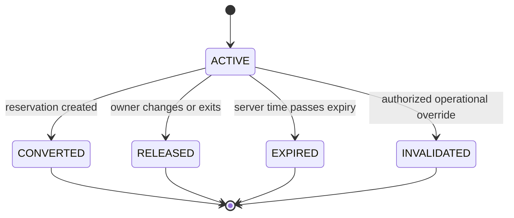
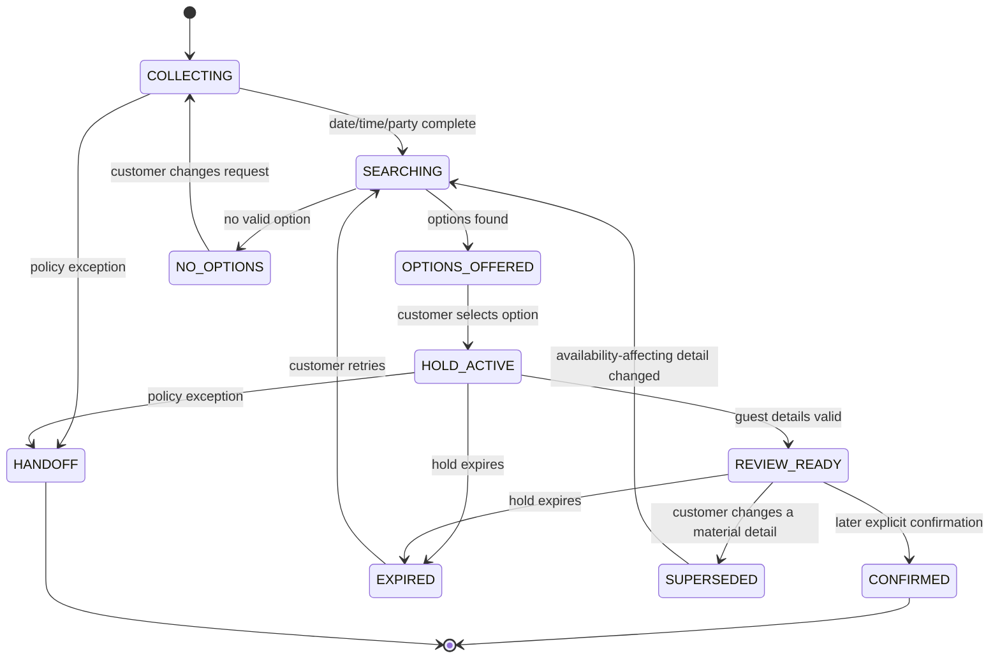
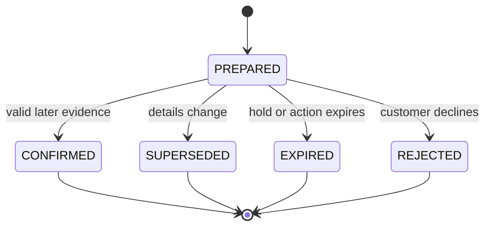
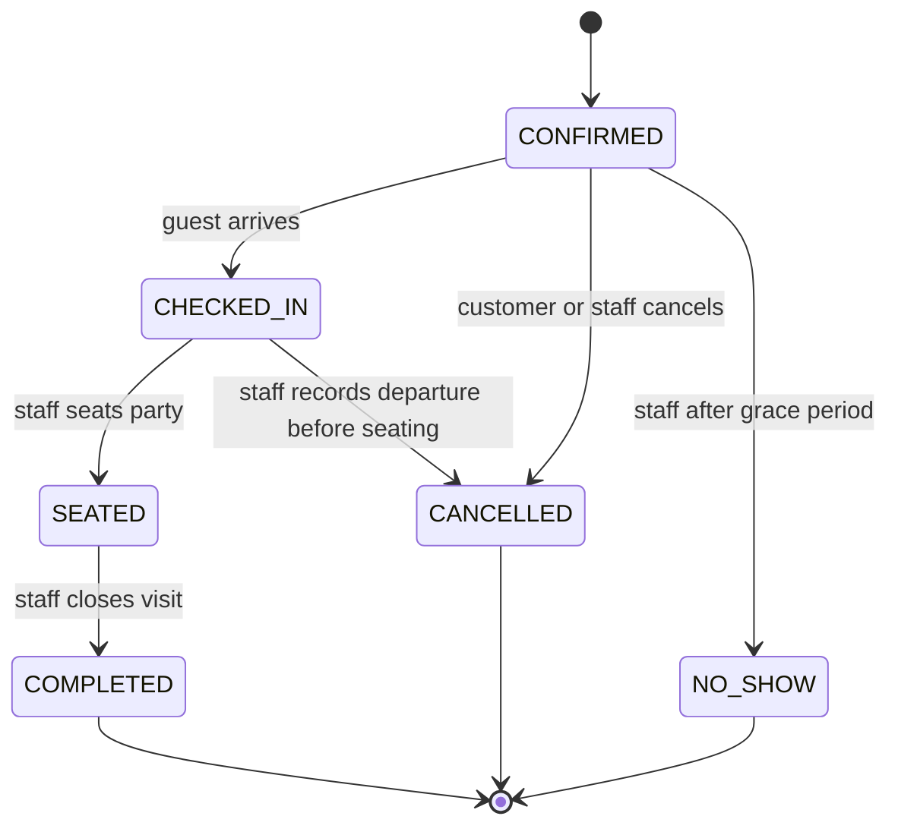

# Reservation Domain Design

**Status:** Workshop 2 proposal for review  
**Depends on:** `mock-restaurant-spec.md`  
**Scope:** Built-in reservation engine, customer form, text/website-voice agent, and staff dashboard

## Design goals

- Return only genuinely bookable options.
- Prevent double-booking under concurrent form, text, voice, and staff activity.
- Keep the language model outside availability, policy, pricing, and write decisions.
- Make every customer-visible write explicit, idempotent, and auditable.
- Keep temporary holds, pending confirmations, and durable reservations separate.
- Preserve the original reservation if a requested modification cannot be completed atomically.
- Use restaurant-local language at the UI boundary and unambiguous instants internally.

## Non-goals

- Waitlists.
- Deposits or payment.
- Recurring reservations.
- Multi-location resource sharing.
- Third-party reservation synchronization.
- Optimization for a restaurant group before the single-location model is proven.

## Terminology

| Term | Meaning |
|---|---|
| Cover | One guest occupying one seat, including children |
| Resource | A table or individual bar seat that cannot be allocated to overlapping bookings |
| Assignment | One compatible set of resources allocated to a party |
| Service period | A configured interval in which reservation starts are offered |
| Occupied interval | Dining duration plus reset buffer, represented as a half-open interval `[start, end)` |
| Search option | A non-binding availability result |
| Hold | A temporary, expiring resource allocation owned by one customer session |
| Pending action | A versioned summary awaiting a separate explicit confirmation |
| Reservation | A durable booking created only after confirmation |
| Manage token | A high-entropy secret authorizing customer self-service; distinct from the human reference |

## Core invariants

1. Every record is scoped by both `restaurant_id` and `location_id`.
2. A reservation or active hold has exactly one assignment.
3. Two active allocations may not share any resource during overlapping occupied intervals.
4. Closures and table blocks behave like unavailable allocations and cannot be bypassed by public channels.
5. Search never writes inventory.
6. A hold is valid only while `expires_at > authoritative_server_now`.
7. Only the session that owns a hold may release, prepare, or convert it.
8. A pending action identifies one hold, one normalized detail set, and one immutable summary version.
9. Confirmation is accepted only from a user turn or explicit UI event whose trusted server sequence is strictly later than the event that presented the current summary version.
10. Converting a hold and creating its reservation happen in one atomic transaction.
11. Repeating an idempotent command with the same key and payload returns its original result.
12. Reusing an idempotency key with a different payload fails.
13. A failed modification leaves the original reservation and assignment unchanged.
14. A modification increments reservation version and emits an event; `MODIFIED` is not a lifecycle status.
15. A short public reference number never authorizes read, change, or cancellation.
16. Exact table numbers are operational data and are not promised to customers.
17. All staff overrides require actor, reason, timestamp, and audit event.

## Time model

### Input and display

- Customer language such as "next Friday at seven" is resolved by the conversation layer against the restaurant's IANA time zone.
- Before a write, the UI displays the full local calendar date, local time, and time-zone abbreviation.
- Domain operations never accept unresolved relative phrases.
- API inputs use `service_date` (`YYYY-MM-DD`), `local_start_time` (`HH:mm`), and `time_zone` (`America/Los_Angeles`) or a normalized timestamp carrying an explicit offset plus zone.

### Storage

- Store authoritative instants as UTC.
- Store the restaurant IANA time-zone ID and the local service date used when the booking was made.
- Store the applicable configuration/service-period version for audit and reproducibility.
- Use database/server time for hold expiration and booking-window checks; never trust the browser clock.

### Daylight saving

- Convert a local candidate through a time-zone library that detects nonexistent or duplicated wall times.
- Reject nonexistent local times with a structured error.
- Require an explicit offset for an ambiguous repeated-hour time.
- Juniper & Stone has no service during the repeated early-morning hour, but the platform behavior remains defined and tested.

## Inventory model

### Resources

Each physical table and bar seat is an indivisible resource with:

- Stable resource ID.
- Dining area.
- Seat capacity.
- Accessibility attributes.
- Effective active interval.
- Operational state.

### Combinations

A table combination is a predefined resource set with:

- Stable combination ID.
- Member resource IDs.
- Effective capacity.
- Allowed party-size range.
- Public/staff eligibility.

The engine never invents combinations. If one member is allocated or blocked, the combination is unavailable.

### Assignments

An assignment contains:

- One single table, one predefined table combination, or one contiguous bar-seat block.
- Occupied start and end instants.
- Party size.
- Area.
- Accessibility satisfaction.
- Allocation score and rule version used to select it.

### Operational blocks

Location closures, area closures, table blocks, and reservation pauses are effective-dated constraints. They have actor, reason, start, optional end, and severity:

- `normal`: new block fails if it conflicts with active holds or reservations.
- `manager_override`: requires a reason and may invalidate active holds; existing reservations enter a staff action queue.
- `emergency`: immediately stops new searches/holds and flags all affected reservations for staff contact.

No block silently cancels or relocates a durable reservation.

## Availability calculation

### Candidate generation

For each request:

1. Validate location, party size, requested local date/range, booking horizon, and minimum lead time.
2. Resolve the matching service period and exceptional-hours override.
3. Determine dining duration and reset buffer from service and party size.
4. Generate candidate starts on the configured 15-minute boundary between first and last seating.
5. Exclude candidates whose occupied interval exceeds the service/area operational end.
6. Build compatible assignments for each candidate based on party size, area, accessibility, and online/staff eligibility.
7. Remove assignments intersecting a closure, resource block, confirmed reservation, checked-in/seated reservation, or unexpired hold.
8. Score remaining assignments and return the best assignment per start/area without exposing physical table IDs.

Intervals overlap when:

`candidate_start < existing_end AND existing_start < candidate_end`

Adjacent half-open intervals do not overlap.

### Allocation score

Use a deterministic lexicographic score:

1. Hard accessibility constraint satisfied.
2. Explicit area preference matched.
3. Single table preferred over a combination.
4. Fewer unused seats.
5. For requests without an accessibility constraint, preserve an equivalent accessible resource.
6. Lower future-fragmentation cost, preserving scarce large-party combinations.
7. Stable resource-ID tie-break for reproducible tests.

The score is a deterministic business function, never an LLM decision.

### Search response

Return:

- Up to five requested-area options nearest the preferred time.
- Up to three clearly labeled alternate-area options only when the requested area lacks availability.
- Full local date/time, dining area, and expected dining duration.
- An opaque `slot_token` representing the normalized request and configuration version, valid for five minutes from search.

The token is not inventory and does not guarantee a slot. `holdSlot` revalidates everything.

### Alternatives

Search in this order:

1. Exact time in requested area.
2. Same area in 15-minute steps up to 45 minutes before/after.
3. Other allowed areas at exact/nearby times.
4. If no option exists, invite a new date/time or staff handoff.

Do not change party size, accessibility need, or service date without explicit customer input.

## Hold design and concurrency

### Hold creation

`holdSlot` runs in one transaction:

1. Validate slot token, session, location, configuration, and current time.
2. Recompute the candidate.
3. Acquire resource locks in stable resource-ID order.
4. Recheck all intersecting allocations and blocks.
5. Insert one seven-minute hold with the chosen assignment.
6. Commit and return hold ID, expiration, and normalized selection.

The persistence layer must enforce the no-overlap invariant even if application checks race. The exact mechanism is selected with the database, but it must provide equivalent transactional protection rather than process-local locking.

### Hold lifecycle

- Expiration is authoritative even before a cleanup job updates the stored status.
- Cleanup may eagerly mark expired holds, but queries always evaluate `expires_at`.
- A customer session may own at most one active hold per location across the form, text, and voice channels. A second hold request must explicitly identify the existing hold as `replace_hold_id` or returns `ACTIVE_HOLD_EXISTS`.
- Selecting another slot releases the old hold only after the new hold succeeds; otherwise the old valid hold remains.
- Holds contain no guest PII.

### Staff conflicts

- A normal table block that overlaps an active hold returns `RESOURCE_HELD`.
- A manager may force the block with a reason. The hold becomes `INVALIDATED`, the customer session receives a slot-lost event, and no reservation is created.
- A staff reservation competes under the same allocation transaction as a public reservation.
- No channel has a race-condition bypass.

## Customer booking workflow

Workflow state belongs to the conversation/application layer. It does not replace hold or reservation state.

### Material changes

Changes to date, time, party size, area, accessibility constraint, name, phone, or policy acknowledgment supersede the pending action. Availability-affecting changes require a new search/hold. Contact-only changes may retain the hold but produce a new pending-action version and summary.

## Pending action and confirmation

### Pending-action lifecycle

The prepared record includes:

- Pending-action ID.
- Owner session/principal.
- Hold ID.
- Canonical detail payload and hash.
- Human-readable summary generated from structured fields.
- Summary version.
- Trusted `summary_presented` event ID and sequence, recorded when the structured summary is emitted to the customer channel.
- Required policy acknowledgment.
- Expiration no later than hold expiration.

### Accepted confirmation evidence

Website:

- Authenticated session.
- Explicit click/tap on the confirmation control rendered for the current summary version.

Text:

- Finalized later user message.
- Explicit affirmative intent tied to the current pending action.
- The confirming tool call references the pending-action ID/version.
- The stored customer turn belongs to the same session and has a sequence strictly greater than the current pending action's `summary_presented` sequence.

Voice:

- Finalized later input transcript captured after the spoken/read visual summary.
- Explicit phrase such as "Confirm the reservation" or "Yes, book it"; ambiguous acknowledgments such as "okay" prompt a clarification.
- Transcript turn ID and hash accompany the tool call.
- The backend reloads the turn and requires its trusted sequence to be strictly greater than the current pending action's `summary_presented` sequence.
- The visual confirmation control remains available as a fallback.

The backend rejects confirmation from the same event/turn that created the summary, an expired/superseded action, changed payload, wrong session, or replay with a different idempotency key.

## Reservation lifecycle

`MODIFIED` and `LATE` are events/attributes, not lifecycle states.

### Transition rules

| From | To | Actor | Preconditions | Inventory effect |
|---|---|---|---|---|
| New | Confirmed | Customer or staff | Valid assignment and atomic create | Assignment becomes durable |
| Confirmed | Checked in | Staff | Not cancelled/no-show; reasonable arrival window | No change |
| Confirmed | Cancelled | Customer or staff | Authorized; not seated | Release future allocation |
| Confirmed | No-show | Staff | Start plus 15-minute grace has passed | Release remaining allocation |
| Checked in | Seated | Staff | Assigned resources available | Mark physically occupied |
| Checked in | Cancelled | Staff | Party leaves before seating; reason required | Release allocation |
| Seated | Completed | Staff | Visit ended | Release operational occupancy |

Terminal states do not transition through public operations. Incorrect terminal staff actions require a manager support correction procedure, not silent record editing.

### Derived attributes

- `is_late`: arrived after start but before/at release decision.
- `late_cancellation`: cancelled inside policy cutoff.
- `source`: website form, text agent, website voice, staff, or walk-in.
- `needs_staff_attention`: policy exception, area closure, allergy note, or operational conflict.

## Creation transaction

`confirmReservation` performs:

1. Authenticate session and pending-action ownership.
2. Validate later confirmation evidence and idempotency.
3. Lock pending action and hold.
4. Verify both remain active and hashes/versions match.
5. Revalidate location, policy, and assignment against authoritative time.
6. Create reservation, guest/contact records, assignment, status event, manage token hash, reference, and audit event.
7. Mark hold `CONVERTED` and pending action `CONFIRMED`.
8. Commit once.

No confirmation is returned before commit. If the client times out after commit, retrying the same idempotency key returns the original reservation.

## Modification design

Customer modifications outside the two-hour cutoff use prepare/confirm just like creation:

1. Retrieve using manage token or current owning session.
2. Search and hold replacement inventory without releasing the original assignment.
3. Prepare a before/after summary.
4. Obtain separate confirmation.
5. In one transaction, validate the replacement hold, update the reservation/version, replace the assignment, release the old assignment, convert the hold, and emit `reservation.modified`.

If any step fails, the original reservation remains confirmed and unchanged.

Contact/note-only changes do not require a resource hold but still use optimistic reservation versioning and explicit review for customer changes.

Inside two hours, the customer receives a staff handoff/ticket. Staff may override with a reason.

## Cancellation design

- Prepare a cancellation summary showing reservation identity, date/time, and late-cancellation policy.
- Require a separate confirmation.
- Atomically set `CANCELLED`, release inventory, and emit events.
- Repeating the same confirmation returns the already-cancelled result.
- Cancelling an already completed/no-show reservation returns `INVALID_STATE`.
- Staff cancellation requires a customer-visible reason; manager policy override is audited.

## Customer-channel behavior

### Conventional website form

- Uses structured date, party, area, slot, contact, and review controls.
- A visible hold countdown begins only after slot selection.
- The confirm button carries pending-action ID/version, never raw price/availability authority.

### Text agent

- Calls the same search, hold, prepare, and confirm operations.
- Presents options as structured cards where possible.
- Uses server-rendered summaries rather than composing critical details from memory.
- A model-generated claim never substitutes for a successful tool result.

### Website voice

- Reuses the text workflow state and tools.
- Displays finalized input/output captions.
- Reads dates as weekday, month, day, year; reads phone numbers in grouped digits; reads time with "AM/PM Pacific time."
- Stops and asks for correction when a material transcript is uncertain or contradicted.
- Never confirms based solely on acoustic confidence or the model's conversational tone.

## Staff operations

### Views

- Service calendar with covers and capacity pressure.
- Reservation list/timeline by service and area.
- Reservation detail with customer-visible and internal notes separated.
- Holds visible only for troubleshooting/availability, not as confirmed covers.
- Relocation queue for area closures.
- Audit timeline.

### Commands

- Create reservation or walk-in.
- Modify time, party, area, assignment, contact, and notes.
- Check in, seat, complete, cancel, or mark no-show.
- Block resource/area/location.
- Force an override with manager permission and reason.

### Walk-ins

A staff-created walk-in may begin in `CHECKED_IN` with `source = WALK_IN`, but it must acquire an assignment through the same collision checks and emit both creation and arrival events atomically.

## Authorization

| Actor | Authority |
|---|---|
| Anonymous/session customer | Search; own hold; create through pending confirmation |
| Manage-token holder | Read, prepare change/cancel for one reservation |
| Staff | Operational lifecycle, notes, non-policy overrides within capacity |
| Manager | Configuration and policy overrides with reason |
| Model | None directly; may request allowlisted operations for the current authenticated context |

The manage token is generated once, returned only to the customer channel, stored only as a hash, and excluded from model prompts, logs, analytics, and staff copy controls.

## Events and audit

Domain events include:

- `hold.created`, `hold.released`, `hold.expired`, `hold.invalidated`, `hold.converted`
- `reservation.created`, `reservation.modified`, `reservation.cancelled`
- `reservation.checked_in`, `reservation.seated`, `reservation.completed`, `reservation.no_show`
- `reservation.staff_attention_requested`
- `inventory.blocked`, `inventory.unblocked`, `area.closed`, `area.reopened`

Each event records:

- Event ID and type.
- Restaurant/location scope.
- Aggregate ID and version.
- UTC occurrence time and local service date where relevant.
- Actor type/ID and source channel.
- Correlation ID, causation ID, idempotency key reference.
- Redacted structured payload.

Audit records additionally capture the requested command, authorization decision, validation result, state before/after, and override reason. PII is minimized and access-controlled.

## Failure behavior

| Failure | Customer behavior | System behavior |
|---|---|---|
| No availability | Offer bounded alternatives | No writes |
| Slot lost before hold | Apologize and refresh options | Return `SLOT_STALE` |
| Hold expired | Explain expiration and re-search | No reservation |
| Timeout after create | Show processing/retry state | Same idempotency key resolves outcome |
| Voice/text provider failure | Preserve structured state and switch to text/form | No success-shaped fallback |
| Database unavailable | State that booking cannot be completed | No confirmation/reference |
| Staff forced block | Notify slot no longer available | Invalidate hold, audit override |
| Notification failure after commit | Reservation remains confirmed; show reference in app | Retry notification separately |

Never return a confirmation reference unless the durable reservation transaction committed.

## Metrics

- Search-to-option, option-to-hold, hold-to-confirm conversion.
- No-availability and alternative acceptance rate.
- Hold expiration and slot-stale rate.
- Duplicate-command suppression.
- Concurrency conflicts.
- Staff override and handoff rate.
- Voice correction and ambiguous-confirmation rate.
- Booking operation latency and error rate.

Metrics use pseudonymous IDs and exclude raw phone/email/transcript content.

## Review decisions

- Confirm table-based allocation rather than aggregate cover capacity.
- Confirm seven-minute holds without extension.
- Confirm exact table is operational, while area is customer-facing.
- Confirm `MODIFIED` is an event, not a state.
- Confirm two-hour customer modification cutoff.
- Confirm waitlist remains deferred.
- Confirm explicit voice phrase plus finalized later transcript is acceptable for mock voice confirmation.
