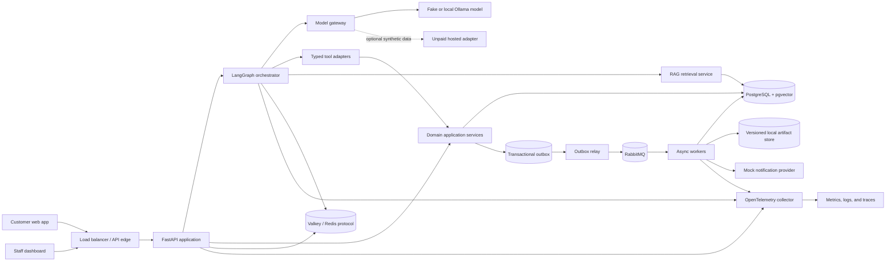
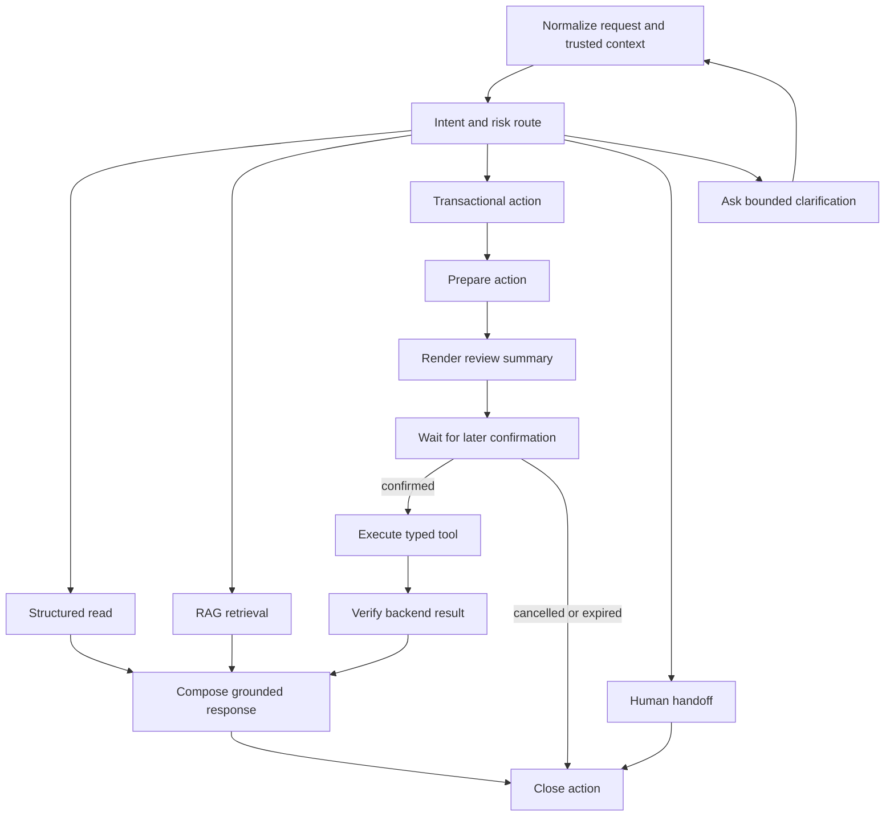
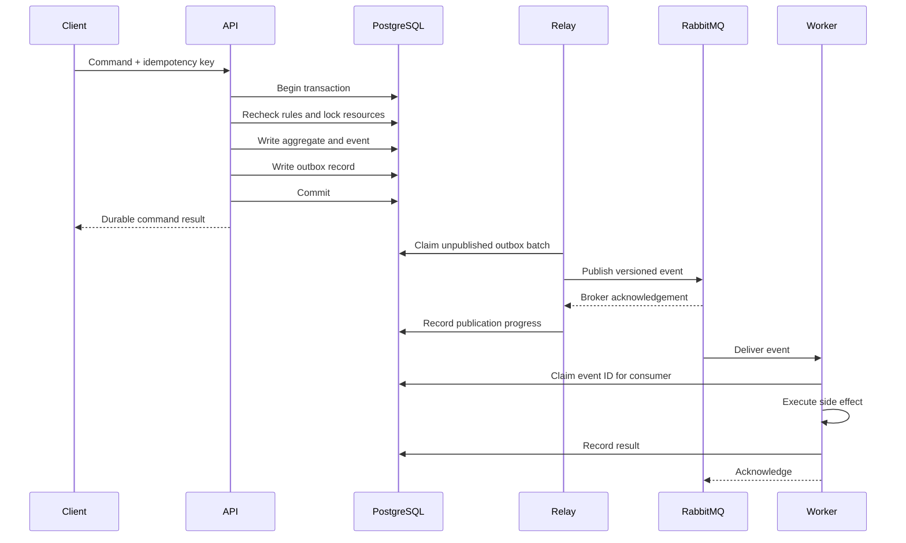

# Technical Learning Architecture

Status: Proposed implementation blueprint  
Parent track: [1v1 Agent Backend Track](1v1-agent-backend-track.md)  
Architecture baseline:
[High-Level Design V1](project-baseline/high-level-design-v1.md)
Cost policy: [Zero-Cost Tooling Policy](free-tooling-policy.md)
Delivery workflow: [GitHub Operating Model](github-operating-model.md)

## 1. Design intent

This architecture is optimized for backend and AI application learning, not for
maximum service count. It deliberately starts with a modular monolith and
separate workers, then introduces distributed-system concerns only where the
product has a real asynchronous or scaling boundary.

The architecture must preserve four invariants:

1. The LLM may interpret and communicate, but deterministic services own
   prices, permissions, availability, and all writes.
2. PostgreSQL is the durable source of truth for restaurant, reservation,
   order, and audit state.
3. Every agent tool is a typed application-service operation with the same
   validation and authorization as a REST call.
4. RAG is used for unstructured knowledge; structured facts are queried from
   structured sources.
5. Every required component has a no-payment local path; no billable service is
   required for implementation, assessment, or deployment.

## 2. System context



The local model, optional hosted model, notification provider, artifact store,
and future reservation or POS providers sit behind interfaces. The application
must be able to substitute a fake adapter in tests and a different provider
without changing domain logic. Hosted free tiers are optional comparisons, not
runtime or graduation dependencies.

## 3. Deployment units

### 3.1 FastAPI application

One deployable application contains:

- Customer and staff REST APIs
- Agent session endpoints
- LangGraph orchestration
- Reservation, order, restaurant-information, and handoff application services
- Authentication, authorization, validation, error mapping, and telemetry
- Read-side RAG retrieval

The code remains separated by modules. Direct imports across domain internals
are disallowed; modules collaborate through application-service interfaces and
published event contracts.

### 3.2 Outbox relay

The relay reads unpublished outbox records in bounded batches, publishes
versioned messages to RabbitMQ, and marks delivery progress. It is independently
deployable so broker backpressure cannot consume API request capacity.

Publication is at least once. A crash after broker acceptance and before the
database update may publish a duplicate, so every consumer must be idempotent.

### 3.3 Workers

Workers process:

- Customer and staff notification jobs
- RAG document ingestion and reindexing
- Offline agent and retrieval evaluation
- Audit export
- Expired artifact cleanup

Workers do not own reservation or order transactions. They react only after the
business transaction commits.

## 4. Suggested source layout

```text
src/
  api/
    customer/
    staff/
    agent/
    middleware/
  domains/
    restaurant/
    reservation/
    ordering/
    handoff/
  agent/
    graphs/
    nodes/
    tools/
    prompts/
    evaluation/
  rag/
    ingestion/
    retrieval/
    citations/
    evaluation/
  platform/
    auth/
    cache/
    database/
    llm/
    messaging/
    observability/
    providers/
  workers/
tests/
  unit/
  integration/
  contract/
  concurrency/
  agent_eval/
  rag_eval/
  load/
```

This is a logical layout, not a requirement to create every package before it
has code. Empty architecture scaffolding is discouraged.

## 5. Data ownership

### 5.1 PostgreSQL

PostgreSQL owns:

- Tenants, restaurants, locations, service periods, and operating exceptions
- Menu items, modifiers, price versions, and availability
- Table resources, table combinations, holds, reservations, and events
- Carts, orders, order lines, totals, and fulfillment status
- Customer manage-token hashes and staff authorization data
- Idempotency records and optimistic versions
- Agent action summaries and auditable tool execution metadata
- Outbox messages and consumer-deduplication records
- Knowledge-document metadata, chunks, embeddings, and active versions

Database constraints must enforce invariants that cannot safely rely on one
application process. The reservation allocation strategy in
[Reservation Domain Design](project-baseline/reservation-domain-design.md)
remains the source
for overlap and transaction rules.

### 5.2 Valkey and Redis-compatible caching

Valkey is the required local cache and uses the Redis protocol and common
client patterns. It may own disposable or reconstructable data:

- Cache-aside entries for safe restaurant and menu reads
- Sliding-window or token-bucket rate-limit state
- Short-lived conversation acceleration and presence hints
- Idempotent request coalescing for expensive read operations
- Distributed coordination only when loss does not invalidate durable truth

Reservation holds, order totals, payment state, and authorization are never
valid solely because a Valkey key exists. Cache keys include tenant, location,
schema version, and source version. Cache invalidation follows committed domain
events; TTL remains a fallback, not the primary consistency strategy.

### 5.3 RabbitMQ

RabbitMQ transports work and integration events:

- `reservation.confirmed.v1`
- `reservation.cancelled.v1`
- `order.submitted.v1`
- `order.status_changed.v1`
- `knowledge_document.changed.v1`
- `handoff.requested.v1`

Each envelope contains:

- `event_id`
- `event_type`
- `schema_version`
- `occurred_at`
- `tenant_id`
- `location_id`
- `correlation_id`
- `causation_id`
- `aggregate_id`
- `aggregate_version`
- Typed payload

Sensitive customer fields are omitted unless the consumer requires them.

### 5.4 Artifact storage

A versioned local filesystem adapter holds source documents, evaluation
reports, and non-sensitive test artifacts. Database records store checksums,
versions, effective dates, and object references. An S3 adapter is designed and
tested against the same interface but does not require a cloud account.

## 6. Agent workflow

The agent is a state machine, not an unrestricted loop.



### 6.1 Trusted context

The server injects tenant, location, authenticated actor, channel, locale,
request ID, and capability flags. The model cannot supply or override these
values.

### 6.2 Tool boundary

Every tool:

- Uses a Pydantic input and output schema
- Has a narrow read or command purpose
- Calls an application service, not an ORM session directly
- Revalidates authorization, state, version, idempotency, and business rules
- Returns the shared result envelope and stable error code
- Emits timing and outcome telemetry with sensitive fields redacted

Read tools and command tools are registered separately. Command tools require a
pending action produced after a review summary; raw conversation text cannot
serve as authorization to mutate data.

### 6.3 Loop and cost controls

The graph defines maximum transitions, maximum tool calls, per-node timeout,
overall deadline, cancellation, and token budgets. Exhausting a limit produces
an explicit fallback or human handoff rather than another unconstrained model
attempt.

### 6.4 Model gateway

The gateway normalizes:

- Text and structured-output requests
- Model and prompt version
- Timeout, bounded retry, and circuit-breaker behavior
- Usage, latency, and cost metadata
- Provider error categories
- Test doubles and deterministic replay fixtures

Business code depends on gateway interfaces rather than provider SDK types.

## 7. RAG architecture

### 7.1 Appropriate RAG content

RAG is appropriate for:

- Dining, cancellation, allergy, accessibility, and private-event policies
- Restaurant background and descriptive FAQ material
- Staff operating guides that are safe for the caller's role

RAG is not used for:

- Current operating hours or holiday exceptions
- Menu prices or item availability
- Real-time table availability
- Reservation, order, or payment status
- Authentication or authorization decisions

### 7.2 Ingestion flow

1. A document is uploaded or seeded with tenant, location, locale, document
   type, effective dates, and source version.
2. The API stores the source and commits a
   `knowledge_document.changed.v1` outbox event.
3. A worker verifies the checksum and supported format.
4. The worker extracts and normalizes text, then creates versioned chunks.
5. Embeddings are generated through an adapter and stored in pgvector.
6. The new version becomes active atomically only after every chunk succeeds.
7. Old versions remain available for audit and rollback until retention removes
   them.

Partial ingestion never makes a half-built corpus active.

### 7.3 Retrieval flow

1. Enforce tenant, location, role, locale, effective-date, and active-version
   filters.
2. Generate a query embedding.
3. Retrieve vector candidates, optionally combined with PostgreSQL full-text
   candidates.
4. Apply a deterministic score threshold and bounded top-k policy.
5. Optionally rerank the small candidate set.
6. Pass only selected excerpts and citation identifiers to the model.
7. Require the answer to cite the supporting section or abstain.

No retrieval result can bypass application authorization.

### 7.4 Evaluation

The committed evaluation set contains:

- Answerable questions and expected source sections
- Similar but unanswerable questions
- Cross-tenant leakage probes
- Stale-version and effective-date cases
- Prompt-injection content embedded in documents
- Paraphrases and ambiguous wording

The report separates:

- Retrieval recall at k
- Retrieval precision at k
- Citation correctness
- Grounded answer correctness
- Correct abstention
- Cross-tenant isolation
- Retrieval and end-to-end latency
- Token and provider cost

An LLM judge may provide one signal, but deterministic expectations and manual
spot checks remain required.

## 8. Transaction and event flow



The customer command succeeds when the durable business transaction commits,
not when notification delivery completes. Outbox age, retry count, dead-letter
count, and consumer lag are operational signals.

## 9. API design requirements

The student must apply:

- `/v1` resource-oriented routes
- OpenAPI schemas generated from typed models
- Shared success and error envelope
- Stable machine-readable error codes
- Server-generated request, correlation, and trace IDs
- `Idempotency-Key` for retryable commands
- `ETag` or explicit aggregate version for optimistic updates
- Bounded pagination for collection endpoints
- UTC timestamps plus explicit restaurant timezone semantics
- Backward-compatible evolution and an API deprecation policy

Agent tools reuse the same application commands but expose narrower schemas.
Internal database identifiers or secrets are not placed in model-visible
payloads.

## 10. Security and privacy boundaries

### Identity and access

- Customers use opaque manage tokens whose hashes are stored
- Staff use authenticated sessions or JWTs with role and location scopes
- Role checks occur in application services, not only at HTTP routes
- Tenant and location filters are mandatory in repositories and retrieval
- Force operations require elevated staff permission and an audit reason

### LLM-specific security

- Treat user text and retrieved documents as untrusted data
- Never allow retrieved text to redefine system policy or tool permissions
- Do not expose API keys, manage tokens, raw access tokens, or database
  credentials to the model
- Require explicit confirmation for write operations
- Enforce tool argument schemas, limits, and server-injected context
- Redact customer identifiers from prompts and telemetry when not required

### Environment policy

The deterministic fake, local Ollama model, and local embedding model are the
required paths. Optional unpaid hosted model tiers may use only synthetic
restaurant and customer data, may not have billing enabled, and must fall back
locally on quota or provider failure. Production PII requires a contracted
provider with appropriate data handling, retention, regional, and training-use
terms and is outside this course.

## 11. Reliability and performance plan

### Initial learning targets

These are acceptance targets, not resume claims. The student must run the
defined workload and record actual results before publishing metrics.

| Path | Initial workload | Initial target |
|---|---|---|
| Restaurant and menu reads | 50 requests/second for 10 minutes | p95 under 250 ms, error rate under 1% |
| Reservation commands | 20 requests/second plus last-table contention | p95 under 500 ms, zero double booking |
| Order submission | 20 requests/second with duplicate delivery | No duplicate order or total |
| RAG retrieval only | 10 requests/second on seeded corpus | p95 under 1.5 seconds, no tenant leakage |
| Agent tool execution | 20 concurrent sessions with fake model | No unsafe write or graph-limit breach |
| Outbox recovery | Broker unavailable for 5 minutes | No lost committed event; backlog drains after recovery |

Model inference time is reported separately from internal tool and retrieval
time. Local hardware and optional hosted-provider variance must not hide backend
performance.

### Required failure drills

| Dependency or failure | Expected behavior |
|---|---|
| PostgreSQL unavailable | Reject stateful work explicitly; no success-shaped response |
| Valkey unavailable | Bypass cache or rate-limit conservatively; durable state remains correct |
| RabbitMQ unavailable | Commit command plus outbox; alert on growing outbox age |
| LLM unavailable | Use bounded retry, then deterministic fallback or handoff |
| Embedding provider unavailable | Keep prior active corpus; new version remains inactive |
| Poison message | Retry within policy, then dead-letter with visible recovery metadata |
| Slow external provider | Time out, open circuit when appropriate, and preserve request trace |
| Worker crash after side effect | Redelivery remains safe through consumer idempotency |

## 12. Observability contract

Every service emits structured telemetry with:

- Request, trace, correlation, causation, tenant, location, and aggregate IDs
- Route, command, tool, graph node, model, prompt, and event schema versions
- Latency, outcome, retry count, cache result, queue age, and token usage
- Redacted error category and safe diagnostic context

Required dashboards cover:

- API traffic, latency, errors, and saturation
- PostgreSQL pool usage, slow queries, locks, and transaction failures
- Valkey latency, availability, hit ratio, and evictions
- Outbox age, publish errors, queue depth, consumer lag, retries, and dead letters
- Agent node latency, tool failures, graph limits, model errors, and handoffs
- RAG retrieval latency, empty results, citation rate, and evaluation trend

Trace context propagates from the initial HTTP request through tool execution,
outbox event, broker message, and worker.

## 13. Test strategy

| Layer | Required evidence |
|---|---|
| Domain unit tests | Rules, totals, state transitions, time boundaries |
| API contract tests | OpenAPI request, response, error, auth, and version behavior |
| Database integration tests | Real PostgreSQL transactions, constraints, indexes, and migrations |
| Cache integration tests | Valkey TTL, invalidation, stampede protection, and outage behavior |
| Messaging integration tests | Real RabbitMQ routing, retry, deduplication, and dead letters |
| Concurrency tests | Last-resource races, hold expiry, retry, and optimistic conflicts |
| Agent tests | Deterministic graph paths, typed tools, confirmation, limits, and fallbacks |
| RAG evaluation | Retrieval, citations, abstention, isolation, latency, and versioning |
| End-to-end tests | Web or API flows across synchronous and asynchronous components |
| Load tests | Reproducible workload, environment manifest, baseline, and bottleneck analysis |
| Failure drills | Dependency outage, poison input, replay, rollback, and recovery evidence |

The existing
[Reservation Acceptance Cases](project-baseline/reservation-acceptance-cases.md)
remain mandatory and are automated progressively rather than replaced.

## 14. Delivery progression

### Stage 1: Local development

Docker Compose runs:

- FastAPI application
- Outbox relay
- Worker
- PostgreSQL with pgvector
- Valkey
- RabbitMQ management image
- OpenTelemetry collector
- Prometheus and Grafana

The fake LLM, local Ollama adapter, local embedding model, fake notification
provider, local artifact store, and seeded documents make the full acceptance
suite deterministic and free to run. Optional hosted adapters are disabled in
the default profile.

### Stage 2: Pull-request CI

Every pull request runs:

1. Formatting, lint, and type checks
2. Unit and contract tests
3. PostgreSQL, Valkey, and RabbitMQ integration tests
4. Migration upgrade and downgrade validation
5. Agent and RAG smoke evaluation
6. Container build and vulnerability scan
7. OpenAPI and event-schema compatibility checks

The private-repository trunk workflow, Projects board, mentor approval, squash
merge, and native-protection or free merge-guard profiles are defined in the
[GitHub Operating Model](github-operating-model.md). No change reaches `main`
through the course workflow while a required check is failed or pending.

### Stage 3: Zero-cost local staging

The same images run on kind or k3d. The student creates:

- API, relay, and worker Deployments
- Service and Ingress
- ConfigMap and externalized Secret references
- Startup, readiness, and liveness probes
- Resource requests and limits
- Horizontal Pod Autoscaler exercise
- Migration Job
- Rolling update and rollback procedure
- Pod disruption and failure drill

The course may use lightweight single-instance PostgreSQL, Valkey, and RabbitMQ
workloads in the local cluster or connect to the Docker Compose data services.
These are learning topologies, not production high-availability claims.

GitHub Actions creates an ephemeral kind cluster for migration, deployment,
smoke, and rollback validation. If hosted Actions quota is unavailable, the
same workflow runs on a self-hosted student runner or the commands run locally.
Images are loaded directly with
`kind load docker-image` or `k3d image import`, so a paid registry is not
required.

### Stage 4: Cloud architecture mapping

The student maps, but does not provision, the local deployment to:

- Application, relay, and workers on ECS Fargate
- Images in ECR
- PostgreSQL on RDS
- Valkey or Redis-compatible caching on ElastiCache
- RabbitMQ on Amazon MQ
- Documents and reports in S3
- Secrets in Secrets Manager
- Logs and operational alerts in CloudWatch
- An Application Load Balancer in front of the API

The design covers private networking, availability zones, scaling, backup,
restore, observability, cost drivers, budget alarms, and teardown. The AWS
pricing exercise demonstrates why this complete managed stack cannot be a
guaranteed zero-cost graduation requirement.

## 15. CI/CD release sequence

The local staging release sequence is:

1. Build and tag immutable images.
2. Run all quality and compatibility gates.
3. Load the immutable images into kind or k3d; public GHCR is an optional
   convenience, not a dependency.
4. Apply backward-compatible database expansion migrations.
5. Deploy application, relay, and worker revisions.
6. Run smoke and synthetic transaction tests.
7. Monitor the deployment window.
8. Remove deprecated schema only in a later release.

Rollback restores the prior application revision. A database change that cannot
support both revisions is rejected during design review.

## 16. Required architecture decisions

The student must write and defend ADRs for:

1. Modular monolith before microservices
2. FastAPI as the primary backend
3. PostgreSQL as durable truth
4. pgvector for the first RAG store
5. Valkey responsibilities, Redis-compatible concepts, and prohibited uses
6. RabbitMQ versus Kafka
7. Transactional outbox and at-least-once consumers
8. LangGraph workflow and tool boundary
9. Structured-data lookup versus RAG
10. Zero-cost local staging versus a managed AWS production mapping
11. Authentication and tenant isolation
12. Observability and PII-redaction policy

An ADR is accepted only when it includes context, options, decision,
consequences, reversal cost, and evidence that would trigger reconsideration.

## 17. Spring Boot alternative

If a target role is explicitly Java-heavy, the mentor may approve a route that
replaces FastAPI, Pydantic, SQLAlchemy, and Alembic with Spring Boot, Bean
Validation, Spring Data JPA, and Flyway or Liquibase. The database, Valkey,
RabbitMQ, REST, outbox, observability, deployment, and evaluation expectations
remain unchanged unless the approved zero-cost tool manifest selects another
compatible implementation.

The choice must be made before Sprint 1. The track does not maintain equivalent
Python and Java implementations.
